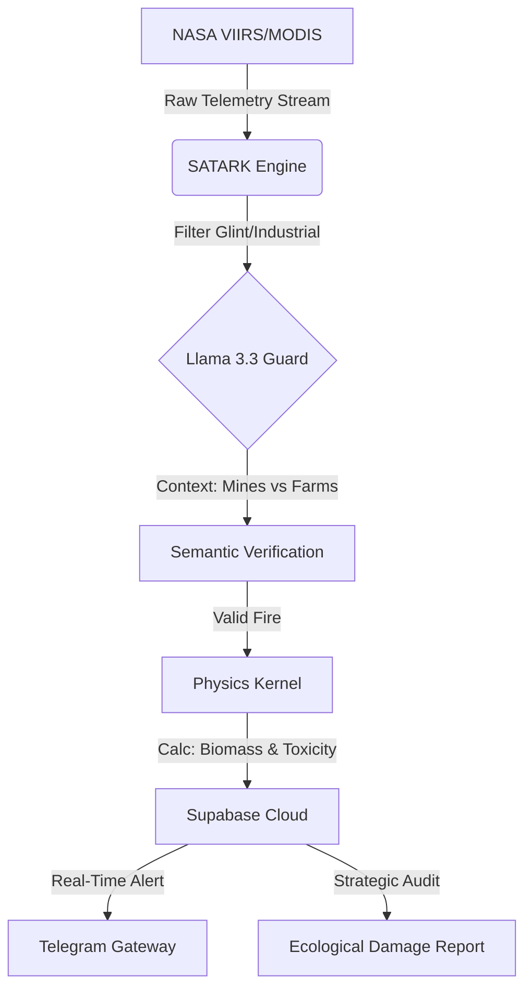

# SATARK: Autonomous Hyper-Local Climate Intelligence Network

<div align="center">

[]()
[]()
[]()
[]()

> **"A ban is just a piece of paper against a wall of fire. If the economics force a farmer to burn, we don't need more police—we need a better equation. SATARK is that equation."**

</div>

---

## 🚀 The Engine
**SATARK** (Sanskrit for *Alert*) is an autonomous "Hybrid Intelligence" network designed to provide high-frequency, verifiable climate data where state systems remain "legally blind". While national sensors suffer from 4-6 hour communication lags, SATARK utilizes a real-time **Detect-Verify-Quantify** loop to identify decentralized "micro-fires" (<50MW) often omitted from global datasets.

It is the technical answer to the **"Latency vs. Resolution Trap,"** fusing multi-constellation satellite telemetry with semantic ground truth to operationalize "Smart Burning" protocols.

### **System Architecture**
The engine bypasses bureaucratic latency by employing an autonomous cron-based inference loop.



---

## 🧠 Technical Sophistication

### **1. Semantic Validation (The Llama 3.3 Border Guard)**

Standard algorithms frequently misidentify industrial heat (mines, steel mills) as biomass combustion. SATARK solves this with an LLM-based verification layer:

* **Contextual Logic:** Passes coordinates through `meta-llama-3-70b-instruct` to analyze proximity to OpenStreetMap (OSM) tags like `industrial`, `quarry`, or `mineshaft`.
* **Geopolitical Filtering:** Distinguishes between fires inside India’s borders and those in neighboring territories (Bangladesh/Pakistan), preventing false diplomatic flags.

### **2. The Physics Kernel (Atmospheric Flux)**

We do not just log coordinates; we quantify the **Cumulative Ecological Debt**.

* **Radiance Conversion:** Implements *Wooster et al. (2005)* coefficients to convert Fire Radiative Power (MW) into total Megajoules of energy.
* **Toxicity Output:** The `monthly_audit.py` module automatically calculates the precise tonnage of **PM2.5 (Aerosol)** and **CO2** injected into the local atmosphere, providing a multidimensional ecological audit.

---

## 📂 Codebase Manifest & Intelligence Outputs

| System Component | Description |
| --- | --- |
| **[`satark_cloud_v5.py`](https://www.google.com/search?q=./satark_cloud_v5.py)** | **The Scanner.** Manages NASA FIRMS ingestion, Llama-based semantic filtering, and Supabase integration. |
| **[`monthly_audit.py`](https://www.google.com/search?q=./monthly_audit.py)** | **The Auditor.** Physics-driven engine that generates "Strategic Ecological Impact Reports". |
| **[`weekly_intel.py`](https://www.google.com/search?q=./weekly_intel.py)** | **The Aggregator.** Compiles temporal trends to map the specific "Smart Burning" windows for local administration. |
| **[`audit_out/`](https://www.google.com/search?q=./audit_out/)** | **The Evidence.** Visual outputs including thermal intensity heatmaps and Markdown reports. |

---

## 📉 Pilot Performance (West Bengal Sector)

Active field trials have established the following benchmarks for the system:

* **⚡ Latency Advantage:** Detected verified fires **~4 hours faster** than the national forest department communication chain.
* **🔍 Micro-Fire Identification:** Captured events <50MW representing **30%** of total regional aerosol load, previously unmapped by state policy.
* **📊 Economic Correlation:** Engine data confirms burning is inversely correlated with labor availability, proving the crisis is an economic math problem, not a lack of environmental awareness.

---

## ⚡ Deployment

```bash
# Clone the SATARK Intelligence Engine
git clone [https://github.com/reexxl1rafat/satark-auto-scanner.git](https://github.com/reexxl1rafat/satark-auto-scanner.git)

# Set Environment Variables (NASA, Supabase, OpenRouter)
export NASA_KEY="your_key"
export OPENROUTER_API_KEY="your_key"

# Execute a Sector Scan
python satark_cloud_v5.py

```

## 📜 Research & Citation

The intelligence generated by this tool supports the primary thesis:

> **Sk Reezaal Arafat (2025).** *The Combustion Paradox: Deconstructing the Socio-Economic Drivers and Cumulative Ecological Debt of India’s Stubble Crisis.[Ongoing]*

---

<div align="center">
<i>Built with rage and hope in the paddy fields of West Bengal.</i>
</div>

```

```
