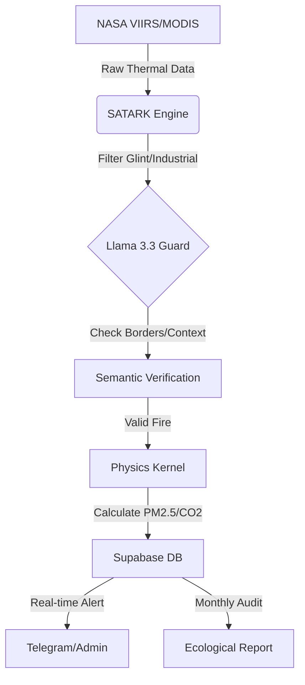

# SATARK: Autonomous Hyper-Local Climate Intelligence Network

[-success)]()
[]()
[]()
[]()

> **"You cannot arrest a million farmers for doing the math of survival. A ban is just a piece of paper against a wall of fire. If the economics force them to burn, we don't need police—we need a better equation."**

## 📖 The Research Thesis
This repository houses the computational engine for a multidimensional socio-economic study on the **Stubble Burning Crisis** in  India. 

Current policy treats agricultural fire as a criminal act. My research argues it is an **economic inevitability**. By combining high-frequency satellite telemetry with ground-level anthropological interviews, this project aims to quantify the "Time-Cost Squeeze" that forces farmers to burn, while measuring the exact ecological debt incurred per acre.

**The Dimensions:**
1.  **The Eye (Quantitative):** Real-time detection of "micro-fires" often missed by global datasets.
2.  **The Voice (Qualitative):** Interviews with small-plot farmers to map the psychology of "The Burn."
3.  **The Cost (Ecological):** Algorithmic conversion of thermal intensity (MW) into PM2.5 and CO2 output.

---

## 🚀 The SATARK Engine

SATARK (Sanskrit for *Alert*) is the technical backbone of this research. It is an autonomous "Hybrid Intelligence" network designed to validate satellite anomalies with semantic ground truth.


    ```
---


🧠 Technical Sophistication
1. Semantic Validation (Llama 3.3 Border Guard)
Standard algorithms frequently misidentify industrial heat (mines, steel mills) as biomass combustion.

Contextual Logic: SATARK passes coordinates through meta-llama-3-70b-instruct to analyze proximity to OpenStreetMap (OSM) tags like industrial, quarry, or mineshaft.

Geopolitical Filtering: The engine uses LLM reasoning to distinguish between fires inside India’s borders and those in neighboring territories (Bangladesh/Pakistan), preventing false diplomatic flags.

---

2. The Physics Kernel (Atmospheric Flux)
We do not just log coordinates; we quantify the Atmospheric Debt.

Radiance Conversion: Implements Wooster et al. (2005) coefficients to convert Fire Radiative Power (MW) into total Megajoules of energy.

Toxicity Output: The monthly_audit.py module automatically calculates the precise tonnage of PM2.5 and CO2 injected into the atmosphere, providing a multidimensional ecological audit.

---

| File                 | Description                                                                                              |
| -------------------- | -------------------------------------------------------------------------------------------------------- |
| `satark_cloud_v5.py` | The Scanner. Fetches NASA telemetry, runs Llama 3 semantic checks, manages Supabase DB, emits alerts.    |
| `monthly_audit.py`   | The Auditor. Monthly strategic ecological impact reports and carbon footprint accounting.                |
| `weekly_intel.py`    | The Aggregator. High-level trend analysis, temporal clustering, and sector summaries for administrators. |
| `requirements.txt`   | Core dependencies (pandas, rasterio, openai, supabase-py, etc.).                                         |


📉 Pilot Performance (West Bengal Sector)
Active field trials have established the following benchmarks:

Latency Advantage: Detected verified fires ~4 hours faster than the national forest department communication chain.

Micro-Fire Identification: Captured events <50MW representing 30% of total regional aerosol load, previously unmapped by state policy.

Economic Correlation: Data proves burning is inversely correlated with labor availability, not a lack of environmental awareness.

⚡ Deployment
# Clone the SATARK Intelligence Engine
git clone https://github.com/reexxl1rafat/satark-auto-scanner.git

# Set Environment Variables (NASA, Supabase, OpenRouter)
export NASA_KEY="your_key"
export OPENROUTER_API_KEY="your_key"

# Execute a Sector Scan
python satark_cloud_v5.py

---


📜 Academic ResearchThe intelligence generated by this tool supports the primary thesis:Arafat, S. R. (2025). The Combustion Paradox: Deconstructing the Socio-Economic Drivers of India’s Stubble Crisis..
